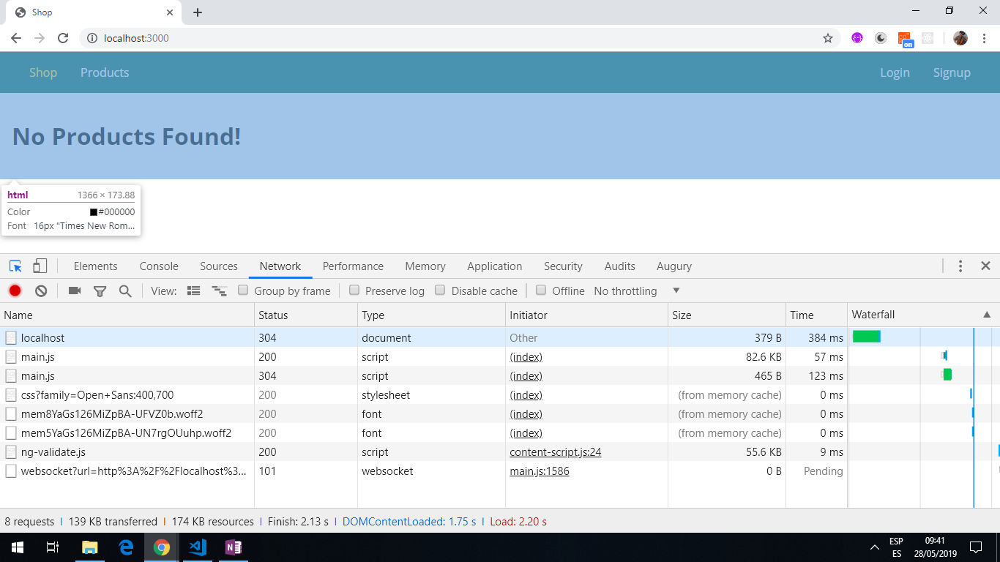
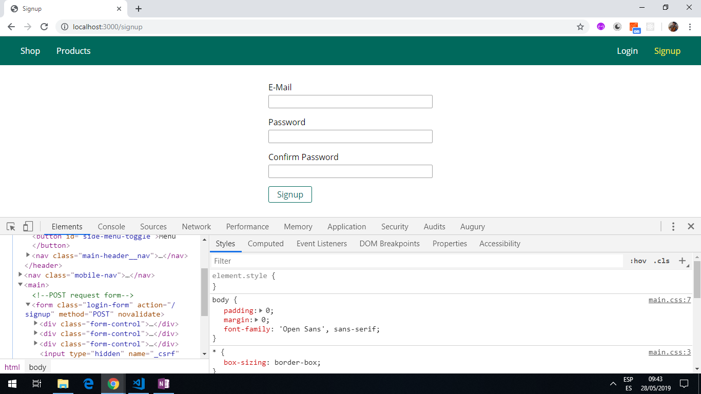

# Node.js, mongoDB & Mongoose Shopping Cart

* Code to learn to learn Node.js. This is part of a [Udemy NodeJS - The Complete Guide (incl. MVC, REST APIs, GraphQL)](https://www.udemy.com/nodejs-the-complete-guide/).

**Note: to open web links in a new window use: _ctrl+click on link_**

## Table of contents

* [General info](#general-info)
* [Screenshots](#screenshots)
* [Technologies](#technologies)
* [Setup](#setup)
* [Features](#features)
* [Status](#status)
* [Inspiration](#inspiration)
* [Contact](#contact)

## General info

* Working shopping cart where products can be created, read, updated and deleted (CRUD) via a local web browser and are stored in a cloud-based mongoDB database. Products can be added to a cart and 'ordered' under an auto-generated order number. The login now created a session cookie that expires after a time set in app.js.

## Screenshots




## Technologies

* [Node.js v10.15.0 LTS](https://nodejs.org)

* [Express v4.16.4](https://www.npmjs.com/package/express)

* [Express-session v1.15.6](https://www.npmjs.com/package/express-session)

* [MongoDB Atlas v4.0](https://www.mongodb.com/cloud/atlas)

* [MongoDB Compass v1.16.3](https://www.mongodb.com/download-center/compass) on an Azure cloud server.

* [Mongoose v5.2.17](https://mongoosejs.com)

* [Nodemailer](https://nodemailer.com/about/) module is used with the [SendGrid API](https://sendgrid.com/docs/) to send new users an email when they first sign up.

* [Multer](https://github.com/expressjs/multer), node.js middleware for handling multipart/form-data; mainly for uploading files.

* [PDFKit](https://pdfkit.org/), a JavaScript PDF generation library for Node and the browser. This is used to create an order invoice pdf.

* [stripe](https://stripe.com), an online payment API, is added.

* [Helmet](https://helmetjs.github.io/) added to allow setting of HTTP headers to increase app security. Needs to be configured.

* [Compression](https://www.npmjs.com/package/compression) middleware added to compress response bodies for all requests that traverse through the middleware, unless they include a Cache-Control header with the no-transform directive, as compressing will transform the body.

## Setup

* type `nodemon app.js` then navigate to `localhost:3000`

## Code Examples

* `/routes/admin.js` router.post route to add a product entered by the user, if authorized.

```javascript
router.post(
  '/add-product',
  [
    body('title')
      .isString()
      .isLength({ min: 3 })
      .trim(),
    body('price').isFloat(),
    body('description')
      .isLength({ min: 5, max: 400 })
      .trim()
  ],
  isAuth,
  adminController.postAddProduct
);

```

## Features

* Once logged in it is possible to add products to a shop website.

* User authorization is done by issuing a time-limited session cookie.

## App Status

* App compiles and navigates to Shop, Products, Signup and Login pages. Signup and login pages work.

* When I add a product I get an error and the app crashes: `TypeError: Cannot read property 'isLoggedIn' of undefined` I think this is an authentication error.

## To-do list

1. Go through course and code and comment better. Fix issue with authentication.

## Inspiration

* [NodeJS - The Complete Guide (incl. MVC, REST APIs, GraphQL)](https://www.udemy.com/nodejs-the-complete-guide/)

* [Medium article by Nick Karnik: Introduction to Mongoose for MongoDB](https://medium.freecodecamp.org/introduction-to-mongoose-for-mongodb-d2a7aa593c57)

## Contact

Repo created by [ABateman](https://www.andrewbateman.org) - feel free to contact me!